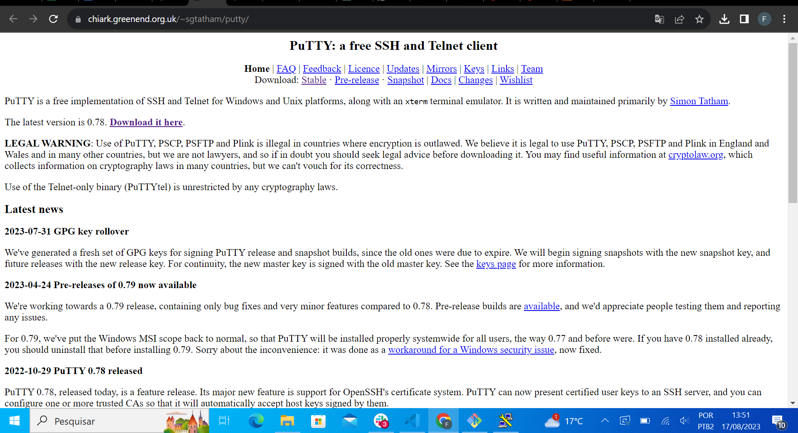
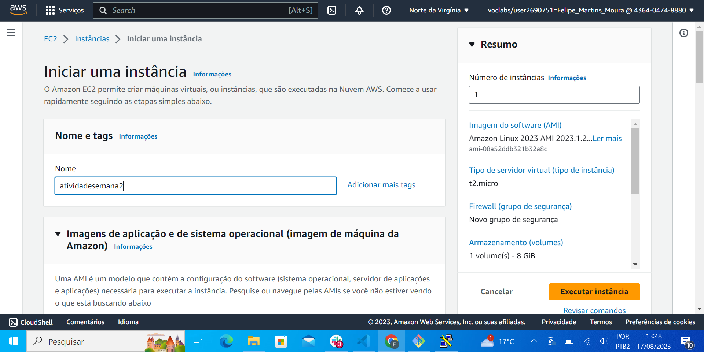
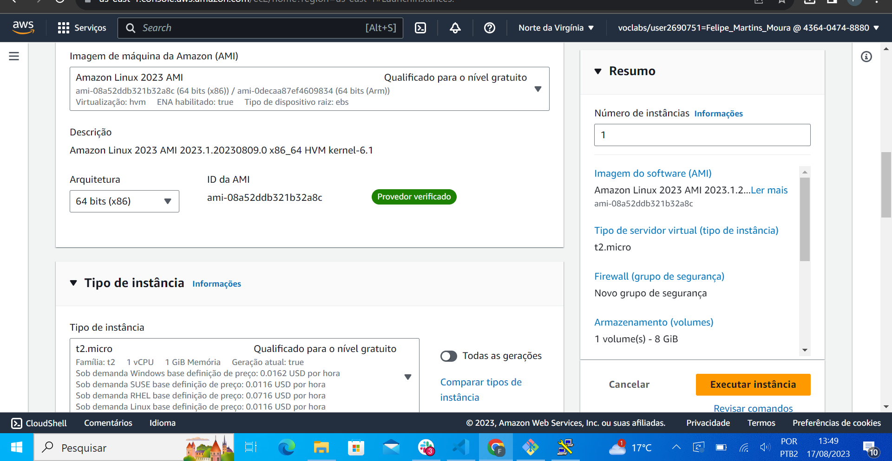
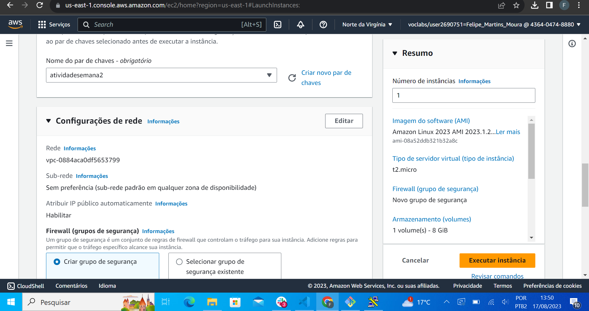
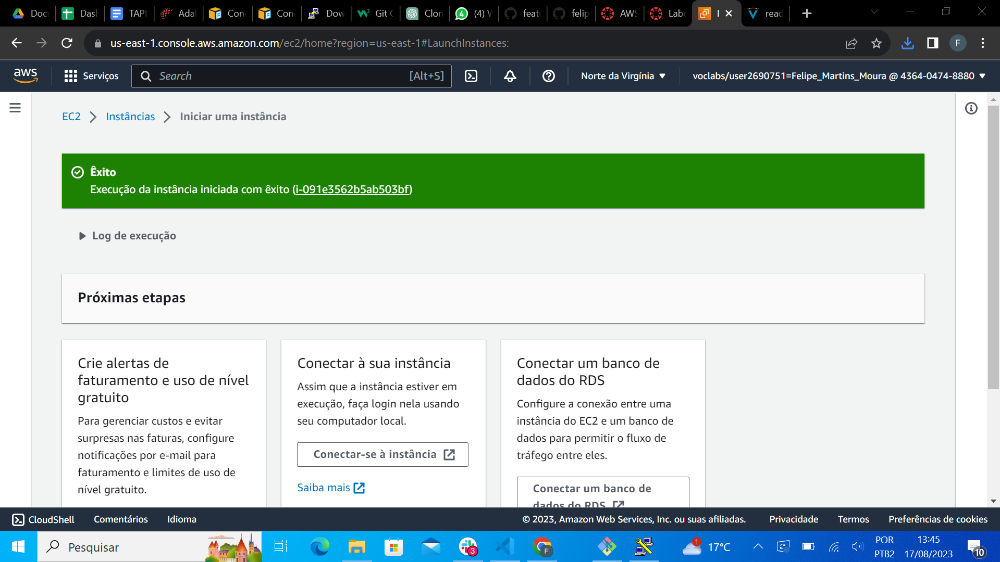

# Atividade-Semana-2

# Relatório Técnico - Configuração de EC2 na AWS

## Introdução
Este relatório detalha a configuração de uma instância EC2 na AWS e sua conexão via SSH. O processo foi documentado usando commits no GitHub.

## Objetivo
O propósito deste relatório é demonstrar o processo de criação, configuração e acesso a uma máquina EC2, demonstrando o conhecimento do uso do SSH.

## Materiais
- Conta AWS
- PuTTY (SSH)
- Git e GitHub

## Método
1. Download Putty
2. Acesso ao Console da AWS e inicio de configuração de uma instância EC2.
3. Configurei as opções de segurança, tipo de instância e outras configurações relevantes.

## Resultados

### Download Putty
 

### Criação da Instância EC2
 
 
 
  
 

---

