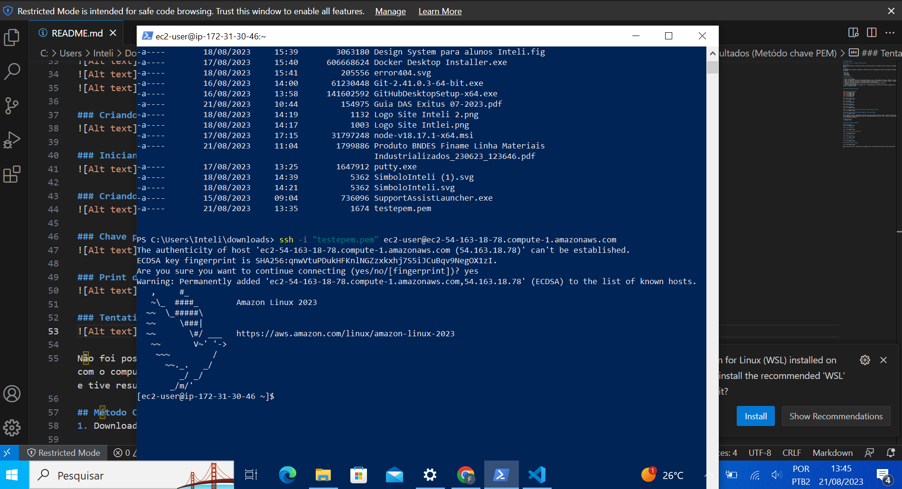

# Atividade-Semana-2

# Relatório Técnico - Configuração de EC2 na AWS

## Introdução
Este relatório detalha a configuração de uma instância EC2 na AWS e sua conexão via SSH. O processo foi documentado usando commits no GitHub.

## Objetivo
O propósito deste relatório é demonstrar o processo de criação, configuração e acesso a uma máquina EC2, demonstrando o conhecimento do uso do SSH.

## Materiais
- Conta AWS
- Git e GitHub

## Método 

1. Entrar no AWS Academy
2. Clicar nos seguintes hiperlinks dentro da AWS Academy: Cursos -> AWS Academy Learner Lab -> Módulos -> Laboratório de Aprendizagem 
3. Dentro do laboratório, iniciar o o laboratório através do hiperlink "Start Lab" e aguardar iniciar o console da AWS
4. Acesso ao console da AWS e inicio de configuração de uma instância EC2.
5. Configurei as opções de segurança, tipo de instância e outras configurações relevantes.
6. Criação de uma chave pem
7. Iniciar conexão SSH através do comando "ssh -i "chavasemana2.pem" ec2-54-234-15-12.compute-1.amazonaws.com", utilizando o "DNS IPv4 público" fornecido pela AWS

## Resultados 

### Criação da Instância EC2
 
 
 
  
 

### Criando chaves com IP 
 

### Iniciando AWS
 

### Criando chave pem
 

### Chave pem criada
 

### Print do powershell para mostrar que estou no mesmo diretório da chave
 

### Conexão realizada

---

